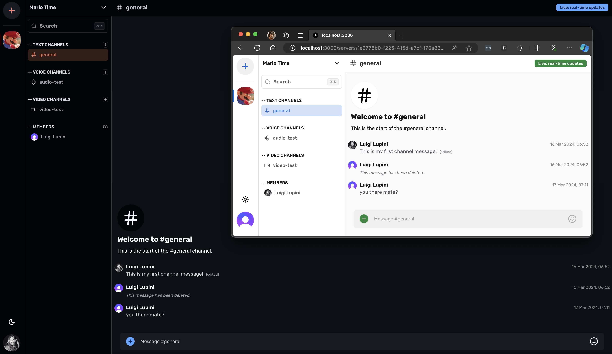

## Discord Clone

> This application uses Next.js, Prisma, Clerk and works with a Socket.IO express server



Regards, <br />
Luigi Lupini <br />
<br />
I ❤️ all things (🇮🇹 / 🛵 / ☕️ / 👨‍👩‍👧)<br />

## Getting Started

First, run the development server:

```bash
npm run dev
```
